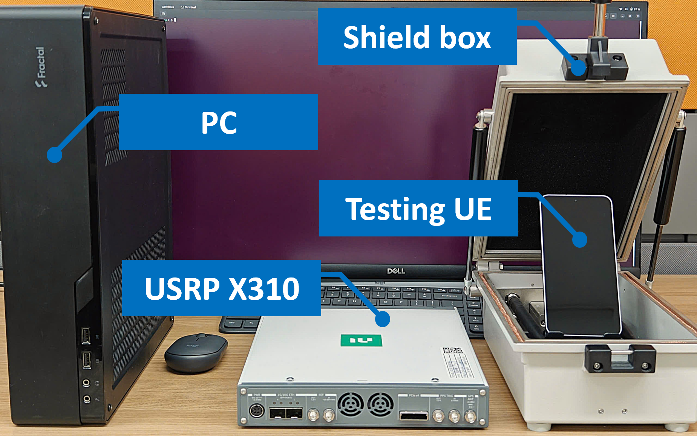

## LLFuzz - An Over-the-Air Dynamic Testing Framework for Cellular Baseband Lower Layers

**LLFuzz** is an over-the-air dynamic testing framework designed to uncover memory corruptions in the Lower Layers of cellular basebands, including PDCP, RLC, MAC, and PHY. Unlike most of prior efforts that focus on Layer 3 protocols, LLFuzz systematically targets Layers 1 and 2 using a channel-driven, configuration-aware fuzzing approach. It leverages 3GPP specifications to generate test cases capable of reaching the Lower Layers without being prematurely rejected.  In the evaluation of 15 commercial basebands from 5 major vendors, LLFuzz uncovered 11 previously unknown memory corruptions: 3 in PDCP, 2 in RLC, 5 in MAC, and 1 in the RRC Layer.

For more details, please refer to our [paper](https://www.usenix.org/conference/usenixsecurity25/presentation/hoang).

### Erratum (Paper Correction)
In Table 1 of our USENIX Security ’25 [paper](https://www.usenix.org/conference/usenixsecurity25/presentation/hoang), we mistakenly listed FirmWire as supporting only LTE. It actually supports GSM and LTE.

## Table of Contents
- 1. [Hardware Requirements](#hardware-requirements)
- 2. [Software Requirements](#software-requirements)
- 3. [Installation](#installation)
- 4. [Run LLFuzz](#run-llfuzz)
- 5. [LLFuzz's Output](#llfuzzs-output)
- 6. [Key source files and their purposes](#llfuzzs-source-code)
- 7. [List of discovered bugs](#list-of-discovered-bugs)
- 8. [Example Configuration File and Explanation](#example-configuration-file-and-explanation)

### Hardware Requirements
- **Software-Defined Radio (SDR):** USRP X310 or B210
- **Target UE:** Android smartphones that support the ADB interface. We recommend using recent smartphones with Qualcomm, MediaTek, Samsung Exynos, or Huawei Kirin chipsets. For example, we tested 15 UEs, including the Samsung Galaxy Note 20 Ultra, Galaxy S20, Galaxy S24 Ultra, Galaxy S22 Plus, Galaxy A31, Galaxy A32, Galaxy S21, Galaxy S24, Galaxy S10e, OnePlus 9 Pro, Xiaomi K40 Gaming, Xiaomi Redmi Note 9T, Google Pixel 6a, Pixel 8 Pro, and Huawei P30 Pro.
- **Host PC:** A high-performance CPU with at least 16 cores, 16 GB of RAM, and 250 GB SSD. 
- **SIM Card:** A programmable SIM card (e.g., [SysmoISIM-SJA2][sim-card]) that enables the LTE radio connection between the UE and LLFuzz's eNB.
- **USB-C cable:** A USB-C cable used to connect the UE (smartphone) to the host PC for ADB communication. 
- **Shield box:** A Faraday cage or shield box used to isolate the LLFuzz eNB signal from other cellular devices. Refer to the image at LLFuzz/image/experiment_setup.png for an example of the experimental setup.
- **GPSDO:** A GPS Disciplined Oscillator (GPSDO) [module][gpsdo-module] is recommended to improve synchronization of the USRP devices. While not mandatory, it can help address synchronization issues that may cause UEs to fail to connect to the LLFuzz eNB. If used, an additional GPS antenna is required to connect to the GPSDO module.

### Software Requirements
- **Operating System:** Ubuntu 18.04 (other Ubuntu versions might cause errors during compilation.)

### Installation
#### 1. Install UHD Library
**UHD dependencies:**
```bash
sudo apt update
sudo apt-get install autoconf automake build-essential ccache cmake cpufrequtils doxygen ethtool \
g++ git inetutils-tools libboost-all-dev libncurses5 libncurses5-dev libusb-1.0-0 libusb-1.0-0-dev \
libusb-dev python3-dev python3-mako python3-numpy python3-requests python3-scipy python3-setuptools \
python3-ruamel.yaml
```
**Clone and build UHD from source** (Make sure the current branch is version 4.0 or higher)
```bash
git clone https://github.com/EttusResearch/uhd.git
cd uhd/host
mkdir build
cd build
cmake ../
make -j8
make test
sudo make install
sudo ldconfig
```
**Download USRP firmware and FPGA images**
```bash
sudo uhd_images_downloader
```
**Test USRP connection**
```bash
sudo uhd_find_devices
sudo uhd_usrp_probe
# Only for USRP X310
sudo sysctl -w net.core.rmem_max=33554432
sudo sysctl -w net.core.wmem_max=33554432
sudo ifconfig <10Gb card interface> mtu 9000
```

#### 2. Build LLFuzz from Source
LLFuzz is built on top of srsRAN eNB, an open-source LTE base station software. Therefore, it requires all of srsRAN’s dependencies. The build process is similar to srsRAN; if you are already familiar with it, you can proceed quickly through the installation.  

**Install dependencies:**
```bash
sudo apt-get install build-essential cmake libfftw3-dev libmbedtls-dev libboost-program-options-dev libconfig++-dev libsctp-dev
```
```bash
sudo apt-get install libglib2.0-dev libudev-dev libcurl4-gnutls-dev libboost-all-dev qtdeclarative5-dev libqt5charts5-dev
```

**Install ADB and Fastboot**
```bash
sudo apt update
sudo apt install android-tools-adb android-tools-fastboot
adb version
```

**Download the LLFuzz source code, then:**  
```bash
cd LLFuzz
mkdir build
cd build
cmake ..
make -j8
```
Once the build is successful, the **binary files** will be generated in the `build/srseNB/src/` and `build/srsePC/src/` directories.

#### 3. Program the SIM card
A programmable SIM card is required to run LLFuzz. This SIM card is used to establish the LTE connection between the UE (smartphone) and srseNB. Please refer to the [srsRAN documentation][srsran-sim] for instructions on how to program the SIM card.
To match the LLFuzz configuration, we recommend using **MCC/MNC 901/55**.

Once the SIM card is programmed, you will obtain the following information:
```bash
> Name     : Magic
 > SMSP     : e1ffffffffffffffffffffffff0581005155f5ffffffffffffxxxxxx
 > ICCID    : 8988211000000xxxxxx
 > MCC/MNC  : 901/55
 > IMSI     : 901550000xxxxxx
 > Ki       : 1A6D20EE06BECCA86AA276DE1Cxxxxxx
 > OPC      : 51E7D953F4F33D0E4EA5671F0Axxxxxx
 > ACC      : xxxx
 > ADM1(hex): 3539383432xxxxxx
 > OPMODE   : None

```
Copy this information into /LLFuzz/config/user_db.csv. The final field in the line is the static IP address of the UE.
```bash 
ue6,mil,001010000xxxxxx,1A6D20EE06BECCA86AA276DE1Cxxxxxx,opc,51E7D953F4F33D0E4EA5671F0Axxxxxx,9001,0000004bf55d,7,172.16.0.3 
```

Also, copy the IMSI into /LLFuzz/config/llfuzz.conf
```bash
# --------------------------------------------
# Configurations for LLFuzz-------------------
#---------------------------------------------
imsi                    = 901550000xxxxxx
```
Once completed, the SIM card is ready to be inserted into the UE.

#### 4. Enable ADB interface (USB debugging) on the Smartphone
LLFuzz requires the ADB interface to collect radio logcat messages, which serve as its oracle for detecting bugs.
To enable ADB, you need to:
- Enable Developer Options on the smartphone:
  - Go to Settings > About phone > Tap "Build number" 7 times until you see "You are now a developer!"
- Enable USB debugging:
    - Go to Settings > System > Developer options > Enable "USB debugging".
- Connect the UE to the host PC via USB-C cable. A USB 3.0 port on the host PC is recommended for better performance.

Refer to the image in `LLFuzz/image/adb.png` for a visual guide.

Verify the connection:
```bash
adb devices
```


### Run LLFuzz
Basically, LLFuzz is an LTE base station capable of fuzzing target UEs over the air. Since it is built on top of srsRAN eNB, the running process is very similar to srsRAN eNB.

#### 1. Test initial UE-eNB connection
First, test whether the UE can connect to the LLFuzz eNB. To do this, run srsePC and LLFuzz eNB in two separate terminals.  
**Note:** Both of them must be run from the `LLFuzz/build/` directory. Otherwise, the configuration files will not be found.

```bash
# In the first terminal, run srsePC
cd LLFuzz/build/
sudo ./srsepc/src/srsepc ../config/epc.conf

# In the second terminal, run LLFuzz eNB
sudo ./srsenb/src/srsenb ../config/llfuzz.conf
```
Then, toggle Airplane mode on the UE or reboot it to enable the UE-eNB radio connection.
It is recommended to use a shield box (e.g., a Faraday cage) to prevent the LLFuzz eNB's signal from interfering with other cellular devices.
Please refer to our experimental setup image at `LLFuzz/image/experiment_setup.png`.  
If the UE connects successfully with ADB enabled, you will see the following message in the LLFuzz eNB terminal:

```bash
List of devices attached
24061JEGR0XXXX  device

[ADB] Device Connected

Opening 1 channels in RF device=default with args=default
RF device 'UHD' successfully opened

==== eNodeB started ===
Type <t> to view trace
Setting frequency: DL=xxx.0 Mhz, UL=xxx.0 MHz for cc_idx=0 nof_prb=100
[MAC] SF: 547:1 RACH:  cc=0, pci=429, preamble=45, offset=1, temp_crnti=0x46
[RRC] User 0x46 (70) connected
```
**Tips for enabling UE connection**  
If the UE fails to connect to the LLFuzz eNB for unknown reasons, try the following:
- Set the APN to `srsapn` on the UE
- Force UE to use LTE network only: 
  - Open the dialer app and enter `*#*#4636#*#*` to open the testing menu.
  - Select "Phone Information" and set "Preferred network type" to "LTE only".
- Manually select the network operator:
  - Go to Settings > Network & internet > Mobile network > Disable "Automatically select network".
- If you are using a Samsung smartphone, the best way is forcing the UE to use a specific band:
  - Open the dialer app and enter `319712358#` to open the service mode. Enter password `996412` or `774632`.
  - Select "Network Setting" > "Network Mode" > Select the three dots on the top left corner > "Band Selection" > Choose the same band as the LLFuzz eNB and select "Selection".

#### 2. Run LLFuzz to test different LTE Layers/states/basebands.
LLFuzz supports fuzzing various LTE protocol layers, including PDCP, RLC, MAC, and PHY. For these layers, LLFuzz repeatedly triggers the LTE Attach procedure and sends malformed test cases to the UE in the targeted state. We define four states for the lower layers based on the establishment of logical channels during the LTE Attach procedure, as shown in the figure below.

<p align="center">
  
  <!--  -->
</p>

To simplify the fuzzing process, LLFuzz uses a configuration file located at `config/llfuzz.conf` to specify all important parameters.
A full example and detailed explanation of the configuration file are provided at the end of this README.
For a quick start, this section covers only the basic configurations needed to begin fuzzing.

In genenal, before running LLFuzz eNB, you might need to update the following parameters in the configuration file:  
- **targetLayer:** The target Layer to fuzz. Options: `PDCP`, `RLC`, `MAC`, or `PHY`.
- **fuzzingState:** The target state to fuzz. Options: `state1`, `state2`, `state3`, or `state4`. Due to LTE Lower-Layer design, the MAC and PHY Layers can be fuzzed in all states, while PDCP and RLC Layers can only be fuzzed in state 3 and state 4.

For example, to fuzz the MAC Layer in state 4, set the following parameters in the configuration file:
```bash
targetLayer             = MAC
fuzzingState            = state4
# Other parameters remain unchanged
# Don't forget to update the IMSI of the SIM card
imsi                    = 90155000005xxxx
```

Then, run srsePC and LLFuzz eNB similarly to the initial connection test:
```bash
# In the first terminal, run srsePC
cd LLFuzz/build/
sudo ./srsepc/src/srsepc ../config/epc.conf

# In the second terminal, run LLFuzz eNB
cd LLFuzz/build/
sudo ./srsenb/src/srsenb ../config/llfuzz.conf
```

Once the LLFuzz eNB is started, you might **need to type** `n` `enter` to start the fuzzing process. Upon starting, you should see output similar to the following in the LLFuzz eNB terminal:
```bash
==== eNodeB started ===
Type <t> to view trace
Setting frequency: DL=xxx Mhz, UL=xxx MHz for cc_idx=0 nof_prb=100
[MAC] SF: 323:1 RACH:  cc=0, pci=429, preamble=37, offset=1, temp_crnti=0x46
[RRC] User 0x46 (70) connected

n
Started LLFuzz, enter n to stop sending test cases.
[MAC] Switch Fuzzer to Mode 23, start_index = 0
[MAC] Switch Fuzzer to Mode 23
[MAC] SF: 580.3 State 234: state234Prepare --> state234PrepareWaitingUE
[ADB] SF: 570.2 Received signal: [RLC -> ADB] switchAirplane
[ADB] SF: 570.2 -- State: Turned on Airplane mode, enabled timer 0
[RRC] Disconnecting RNTI 0x46 (70)

[ADB] SF: 570.2 Sent adbAirPlaneOn signal to rlc
[MAC] Received signal from ADB: [ADB -> MAC] adbAirPlaneOn
[ADB] SF: 570.2 State: Turned off AirPlane mode 1
[MAC] SF: 819:1 RACH:  cc=0, pci=429, preamble=26, offset=1, temp_crnti=0x47
[MAC] SF: 819:6 Added RNTI: 71 to state 2
[MAC] SF: 820:8 Updated RNTI: 71 to state 3
[MAC] SF: 829.4 State 234: state234PrepareWaitingUE --> state234PrepareWaitingADB
[MAC] SF: 829:4 Updated RNTI: 71 to state 4
[RRC] User 0x47 (71) connected

[ADB] SF: 829.4 Received signal: [RLC -> ADB] state1PrepareADB
[ADB] SF: 829.4 State: state1PrepareADB --> monitorLogcat
[MAC] Received signal from ADB: [ADB -> MAC] adbConfigSuccess
[MAC] SF: 833.4 State 234: state234PrepareWaitingUE --> state234WaitingUEIdle, enabled rrcRelease timer
[MAC] State 234: state234WaitingUEIdle --> state234Paging in rem_ue function
[RRC] Disconnecting RNTI 0x47 (71)

[MAC] SF: 843.5 Sent paging to TMSI = 0xdc87e74, State 23: state234Paging --> state234Send
[MAC] SF: 868:1 RACH:  cc=0, pci=429, preamble=30, offset=1, temp_crnti=0x48
[MAC] SF: 868:6 Added RNTI: 72 to state 2
[MAC] SF: 869:8 Updated RNTI: 72 to state 3
[MAC] SF: 877:3 Updated RNTI: 72 to state 4
[RRC] User 0x48 (72) connected

[MAC] SF: 883.3 Rnti = 72, Allocated DCI 1 type 1 1 / 2
[MAC] SF: 883.3 -- Sending State: 4, RNTIState =  4 -- Idx = 0/92882 -- nofCrash: 0
------------------------------------------------------------------
[PDU] NofSubHea: 0|1 -- totalByte: 0|1 -- iseLCID: 0 -- MutatingMacCE: 0 -- eIdx: 0|0

[MAC] SF: 883.4 Rnti = 72, Allocated DCI 1 type 1 1 / 2
[MAC] SF: 883.4 -- Sending State: 4, RNTIState =  4 -- Idx = 1/92882 -- nofCrash: 0
------------------------------------------------------------------
[PDU] NofSubHea: 0|1 -- totalByte: 0|1 -- iseLCID: 0 -- MutatingMacCE: 0 -- eIdx: 0|0

[MAC] SF: 883.5 Rnti = 72, Allocated DCI 1 type 1 3 / 3
[MAC] SF: 883.5 -- Sending State: 4, RNTIState =  4 -- Idx = 2/92882 -- nofCrash: 0
------------------------------------------------------------------
[PDU] NofSubHea: 0|1 -- totalByte: 0|3 -- iseLCID: 0 -- MutatingMacCE: 0 -- eIdx: 0|0

```

**For PHY Layer fuzzing**, as the configurations are more complex, we provide predefined configuration files in `config/phy_fuzz/` directory.
These files are named based on the targeted states, DCI formats, and uplink/downlink directions. For example, to test Downlink DCI format 1 in state 4, use the configuration file `config/phy_fuzz/llfuzz_state4_dci1_dl.conf`.  
**Note:** For PHY Layer fuzzing, a GPSDO may be required when testing DCI formats 1, 2, or 2A, as these involve MIMO communication between the eNB and UE, which requires precise synchronization. To enable the GPSDO clock source, uncomment the `device_args = clock=gpsdo` line in the `/LLFuzz/config/enb.conf` file before running LLFuzz eNB.

```bash
# In the first terminal, run srsePC
cd LLFuzz/build/
sudo ./srsepc/src/srsepc ../config/epc.conf

# In the second terminal, run LLFuzz eNB with PHY fuzzing configuration
cd LLFuzz/build/
sudo ./srsenb/src/srsenb ../config/phy_fuzz/llfuzz_state4_dci1_dl.conf
```

### LLFuzz's Output
LLFuzz generates three output files in the `LLFuzz/pcap/` directory:
- **enb_mac.pcap:** A PCAP file capturing all packets intercepted at the MAC layer, including the sent test cases.
- **crashLog.txt:** A log file containing detailed information about recent test cases that potentially caused the UE to crash.
- **speedLog.txt:** A log file recording the number of test cases sent every 5 seconds, useful for monitoring fuzzing speed.

### LLFuzz's source code
The main source code of LLFuzz is organized in two directories:
- `LLFuzz/srsenb/hdr/stack/mac/`: contains header files (.h)
- `LLFuzz/srsenb/src/stack/mac/`: contains implementation files (.cc)

Key source files and their purposes:  
 - `fuzzer_based.h` and `fuzzer_based.cc`: Skeleton class for the fuzzer implementation.
 - `llfuzz.h` and `llfuzz.cc`: The implementation of ADB Controller, Crash oracle, UE Controller, Fuzzer's state machine, configuration file parser, Layer-specific fuzzer manager, UE's state manager.
 - `mac_fuzzer.h` and `mac_fuzzer.cc`: The implementation of MAC Layer fuzzer, including the test case generation, assembling, and sending.
 - `rlc_fuzzer.h` and `rlc_fuzzer.cc`: The implementation of RLC Layer fuzzer, including the test case generation, assembling, and sending.
 - `pdcp_fuzzer.h` and `pdcp_fuzzer.cc`: The implementation of PDCP Layer fuzzer, including the test case generation, assembling, and sending.
 - `phy_fuzzer.h` and `phy_fuzzer.cc`: The implementation of PHY Layer fuzzer, including the test case generation, assembling, and sending.
 - `utility.h` and `utility.cc`: Utility functions used in LLFuzz.
 - `mac.h` and `mac.cc`: Modified srseNB MAC Layer implementation to support LLFuzz.

### List of discovered bugs

| No. | Tested Smartphones | Baseband            | Layer | Description                                                                                          | State         | Configuration            | Disclosure                       |
|-----|--------------------|-------------------|-------|------------------------------------------------------------------------------------------------------|---------------|--------------------------|----------------------------------|
| B1  |Galaxy Note 20 Ultra <br> Galaxy S20 <br>   OnePlus 9 Pro| Qualcomm          | MAC   | Incorrect handling of the length field in the MAC<br> header when a CCCH sub-header is present       | S2, S3, S4    | -                        | CVE-2025-21477<br> Patched        |
| B2  |Galaxy S22 Plus <br> Galaxy Note 20 Ultra <br> Galaxy S20 <br>   OnePlus 9 Pro | Qualcomm          | MAC   | Incorrect handling of RAR messages containing<br> only sub-headers without any payload               | S1            | -                        | CVE-2024-23385<br> Patched        |
| B3  |Galaxy S24 Ultra<br>Galaxy S22 Plus <br> Galaxy Note 20 Ultra <br> Galaxy S20 <br>   OnePlus 9 Pro | Qualcomm          | RLC   | Incorrect handling of the extension part of the RLC<br> UM Data PDU header                           | S4            | UM, 5-bit SN             | Verified                      |
| B4  |Galaxy A31 <br> Galaxy A32 | MediaTek          | MAC   | Incorrect handling of zero value in the length field<br> of the MAC sub-header                       | S3            | -                        | CVE-2024-20076<br> Patched        |
| B5  |Galaxy A31 <br> Galaxy A32 | MediaTek          | MAC   | Incorrect handling of MAC PDUs with many<br> MAC CE sub-headers                                      | S2, S3, S4    | -                        | CVE-2024-20077<br> Patched        |
| B6  |Galaxy A31 <br> Galaxy A32 | MediaTek          | MAC   | Incorrect handling of continuously malformed<br> MAC PDUs during the attach procedure                | S2, S3        | -                        | Affects only older firmware       |
| B7  |Xiaomi K40 Gaming <br> Xiaomi Redmi Note 9T | MediaTek          | PDCP  | Incorrect handling of 5-byte PDCP Data PDUs for<br> the control plane                                | S4            | -                        | CVE-2025-20659<br> Patched        |
| B8  |Galaxy S24 <br> Pixel 6a | Exynos <br> Tensor    | RLC   | Incorrect handling of RLC AM Data PDUs<br> containing many data chunks                               | S3, S4        | AM, 11-bit LI, 10-bit SN | CVE-2025-26781/26782 <br> Patched   |
| B9  |Galaxy S24 | Exynos            | PDCP  | Incorrect handling of 1-byte PDCP Data PDUs for<br> the user plane                                   | S4            | 12-bit SN                | CVE-2025-26780<br> Patched                      |
| B10  |Xiaomi K40 Gaming (5G) | MediaTek          | 5G PDCP  | We will provide technical details after the vendor's patch                                | -            | -                        | Under review       |
| B11  |Xiaomi K40 Gaming (5G) | MediaTek          | 5G RRC  | We will provide technical details after the vendor's patch                                | -            | -                        | Under review        |


### Example Configuration File and Explanation

```bash 
#--------------------------------------------
# Configurations for srseNB------------------
#--------------------------------------------

# Path to the srseNB configuration files
# including enb.conf, sib.conf, rr.conf, rb.conf
# These are included in the /config/ directory by default.
enb_config             = ../config/enb.conf
sib_config             = ../config/sib.conf
rr_config              = ../config/rr.conf
rb_config              = ../config/rb.conf

# MCC and MNC of the network
# These values should match the SIM card configuration
# Recommend using MCC=901 and MNC=55 to match with ePC configuration
mcc                    = 901
mnc                    = 55

# The number of PRBs (Physical Resource Blocks) of the eNB
# This value corresponds to the channel bandwidth
# For example, 100 PRBs corresponds to 20 MHz bandwidth
# 50: 10 MHz, 25: 5 MHz, you don't need to change this value
n_prb                  = 100

# Transmission Mode and number of ports for MIMO.
# No change needed for MAC/RLC/PDCP fuzzing.
tm                     = 1
nof_ports              = 1

# The EARFCN of the eNB, corresponds to the center frequency of the channel
dl_earfcn              = 3400

# TX and RX gains for the eNB
tx_gain                = 120
rx_gain                = 60

# --------------------------------------------
# Configurations for LLFuzz-------------------
#---------------------------------------------

# Target protocol layer to fuzz. Options: PDCP, RLC, MAC, PHY
targetLayer             = MAC

# Target UE state to fuzz. Options: state1, state2, state3, state4
fuzzingState            = state4

# Enable ADB-based crash detection (always keep this true).
enableADB               = true

# Index of the starting test case.
# Use 0 to start from the beginning. You can resume from a specific index when debugging a crash.
startIdx                = 0

# Number of test cases to send in each fuzzing session.
# Recommended value: 5 (for optimal performance).     
NofTestCasesPerSS       = 5

# Enable verification mode for bug reproduction.
verifyingMode           = false

# IMSI of the UE’s SIM card (must match the inserted SIM).    
imsi                    = 90155000005xxxx

# Whether to send Uplink DCI (DCI0) in PHY Layer fuzzing.
# Only set to true when fuzzing DCI0.
sendUplinkDCI           = false

# Time (ms) to wait after a UE crash before attempting recovery.
recoverTimerThres       = 5000

# Timers and thresholds for device-specific behaviors.
# Advanced options, usually do not change these values.
waitingConnTimerThres   = 4000 
waitConnAfterPagingThres = 500
enableNotWorkingReboot  = false
nofFailedConnReboot     = 8

# Enable speed logging (cases/5s).
enableSpeedLog          = true

# Paths to output files (saved in /pcap/ directory).
speedLogFilename        = ../pcap/speedLog.txt
crashLogFilename        = ../pcap/crashLog.txt
enbPCAPFilename         = ../pcap/enb_mac.pcap
```

[srsran-sim]: https://docs.srsran.com/projects/project/en/latest/tutorials/source/cotsUE/source/index.html#sim-programming
[gpsdo-module]: https://www.ettus.com/all-products/gpsdo-mini/
[sim-card]: https://sysmocom.de/products/sim/sysmousim/index.html
